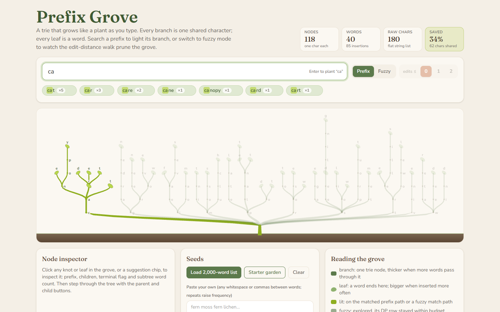
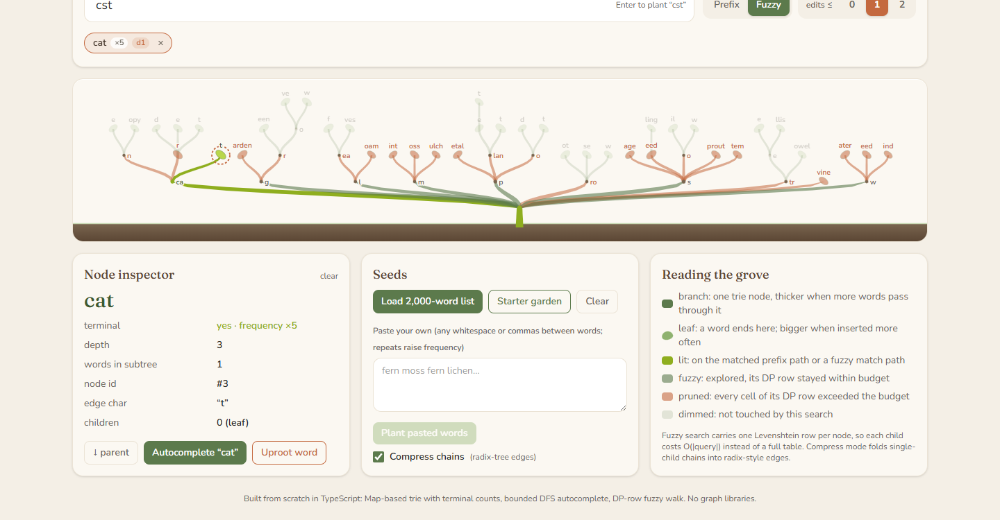
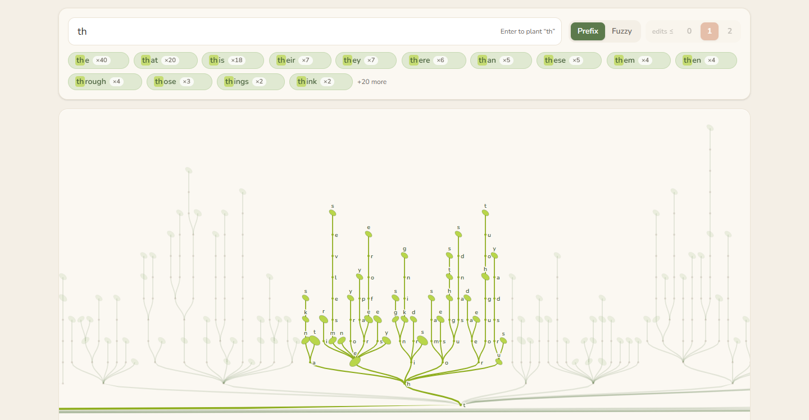

# Prefix Grove

A trie that grows like a plant as you type, with autocomplete, frequency ranking, and edit-distance fuzzy search all visible in the branches.



## Features

- **Trie from scratch** — Map-based nodes with per-node frequency counts and subtree word totals; insert, delete (with dangling-node pruning), prefix lookup.
- **Live autocomplete** — ranked by frequency, then alphabetically. The matched path and its whole subtree light up; everything else dims.
- **Fuzzy mode** — a DFS carrying one Levenshtein DP row per node, budget 0–2. Explored branches stay green, pruned subtrees turn clay so you can see exactly where the walk gave up.
- **Seeds** — load a bundled 2,000-word list (weighted by rank), paste your own text (repeats raise frequency), or type a word and press Enter. New nodes sprout up out of their parent.
- **Node inspector** — click any knot, leaf, or chip: prefix, depth, terminal flag with frequency, children, subtree word count. Parent and child buttons step through the tree from the keyboard.
- **Compress toggle** — folds single-child chains into radix-tree style edges labelled with the whole run.
- **Stats bar** — node count, distinct words, insertions, raw characters a flat list would need, and the share saved.
- **Shareable state** — the query, mode, and budget live in the URL (`?q=cst&mode=fuzzy&d=1`).

| Fuzzy `cst` (≤1 edit), compressed, inspecting `cat` | 2,000-word list, prefix `th` |
| --- | --- |
|  |  |

## How it works

**The trie.** Each node holds a `Map<char, node>`, a `count` (how many times the word ending here was inserted; 0 means "not a word") and `words` (distinct words in its subtree). Insert walks the string, creating only the missing suffix, then bumps `words` on every ancestor if the word is new. Delete zeroes the count, decrements `words` up the path, and prunes upward while a node has no children and no count, so `car`, `cart`, `cat` share `c → a` and cost five nodes; deleting `car` keeps all five because `cart` still needs them, while deleting `cart` drops to four.

```
        r ─ t        autocomplete("ca")  →  find "ca", DFS its subtree,
   c ─ a ─ t         collect terminals, sort by (count desc, word asc)
   └── words: 3
```

**Fuzzy search.** A plain Levenshtein table is |word| × |query| per candidate. Instead, the walk hands each node a single DP row: `row[j]` is the edit distance between the prefix spelled so far and the first `j` characters of the query. A child extends its parent's row in O(|query|) using the usual three moves (insert, delete, substitute), so siblings never redo shared work. Because edit distance never decreases as you go deeper, a subtree is cut off as soon as every cell in its row exceeds the budget. Those cut-off roots are what the grove paints clay-coloured; the last cell of the row at a terminal node is the word's distance, which sorts the chips.

**Drawing.** The layout assigns each leaf a column in alphabetical order, centres parents over their children, and maps depth to a row so the root sits at the soil line and branches climb. Each edge is a cubic S-curve widened into a polygon whose thickness eases from the parent's width to the child's, with width proportional to `sqrt(words / total)`, so heavily shared prefixes read as trunks. Compression is a layout concern only: chains of count-0, single-child nodes collapse into one branch whose label is the run of characters, while the underlying trie is untouched.

## Run

```sh
npm install
npm run dev       # local dev server
npm run build     # type-check + production build to dist/
npm test          # vitest
```

## Tech

Vite 8 · React 19 · TypeScript (strict) · Tailwind CSS 4 · Vitest · Fraunces and Nunito via Fontsource. No graph or visualisation libraries; the trie, fuzzy walk, layout, and SVG are all hand-rolled.

## License

MIT © 2026 Jafn
